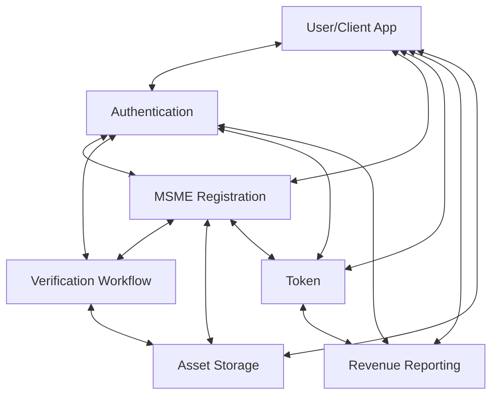

# System Architecture Overview

This document provides a high-level overview of the system architecture, explaining how different canisters interact with each other.

## Canister Structure

The backend is built with a modular architecture consisting of several specialized canisters:

1. **Authentication Canister** - Manages user identities, roles, and sessions
2. **MSME Registration Canister** - Handles MSME profiles and document management
3. **Verification Workflow Canister** - Manages the verification process for MSMEs
4. **Token Canister** - Manages token issuance, transfers, and ownership
5. **Revenue Reporting Canister** - Handles revenue reports and distributions
6. **Asset Storage Canister** - Stores and manages document files
7. **NFT Canister** - (Optional) Handles NFT creation for MSME ownership

## System Interactions



## Key Flows Between Canisters

### User Authentication Flow
1. User interacts with Authentication canister to register/login
2. Authentication canister validates user identity and creates a session
3. Authentication canister provides role information to other canisters

### MSME Registration Flow
1. User (with MSME role) interacts with MSME Registration canister to create a profile
2. MSME Registration canister verifies user's role with Authentication canister
3. User uploads documents to Asset Storage canister
4. MSME Registration canister stores references to these documents
5. User requests verification through Verification Workflow canister

### Verification Flow
1. Verifier is assigned to review an MSME
2. Verifier accesses MSME profile from MSME Registration canister
3. Verifier views documents from Asset Storage canister
4. Verifier updates verification status through Verification Workflow canister
5. Verification Workflow canister updates MSME status in MSME Registration canister

### Investment Flow
1. MSME creates a token offering through Token canister
2. Investor purchases tokens through Token canister
3. Token canister verifies investor status with Authentication canister
4. Token ownership is recorded in Token canister

### Revenue Distribution Flow
1. MSME reports revenue through Revenue Reporting canister
2. Revenue Reporting canister gets token ownership information from Token canister
3. Revenue Reporting canister calculates distributions
4. Token canister processes payments to token holders

## Data Storage Patterns

Each canister maintains its own data storage using a combination of:

1. **HashMap/TrieMap** - For in-memory storage during canister operation
2. **Stable Variables** - For persisting data across canister upgrades

Example from Authentication canister:
```motoko
// In-memory storage
private var userProfiles = TrieMap.TrieMap<Principal, UserProfile>(Principal.equal, Principal.hash);
private var sessions = TrieMap.TrieMap<Text, SessionData>(Text.equal, Text.hash);

// Stable storage for upgrades
private stable var userProfilesEntries : [(Principal, UserProfile)] = [];
private stable var sessionsEntries : [(Text, SessionData)] = [];

// System functions for upgrade management
system func preupgrade() {
    userProfilesEntries := Iter.toArray(userProfiles.entries());
    sessionsEntries := Iter.toArray(sessions.entries());
};

system func postupgrade() {
    userProfiles := TrieMap.fromEntries(Iter.fromArray(userProfilesEntries), Principal.equal, Principal.hash);
    sessions := TrieMap.fromEntries(Iter.fromArray(sessionsEntries), Text.equal, Text.hash);
    userProfilesEntries := [];
    sessionsEntries := [];
};
```

## Security Model

The system implements a role-based access control model:

1. **Authentication**
   - Manages user identities and roles
   - Issues and validates sessions
   - Controls access to restricted functions

2. **Authorization**
   - Each canister verifies that callers have appropriate roles
   - Admin functions are restricted to users with Admin role
   - MSME functions require MSME role
   - Verification functions require Verifier role

3. **Session Management**
   - Sessions expire after a defined period
   - Sessions can be revoked by users or administrators

## Error Handling

Each canister implements error handling using the Result pattern:

```motoko
public type AuthError = {
    #NotAuthorized;
    #ProfileNotFound;
    #AlreadyExists;
    #SessionExpired;
    #InvalidToken;
    #OperationFailed;
};

public shared (msg) func login() : async Result.Result<Text, AuthError> {
    // Implementation with proper error handling
};
```

## Upgrade Strategy

Canisters are designed to be upgradable while preserving state:

1. **State Preservation** - Using stable variables to maintain data across upgrades
2. **Backward Compatibility** - New versions maintain compatibility with existing data structures
3. **Modular Design** - Canisters can be upgraded independently

## Integration with Internet Identity

The system can integrate with Internet Identity for secure authentication:

```motoko
// From internet_identity.mo
public shared (msg) func authenticateWithII(delegationIdentity : Text) : async Result.Result<Principal, AuthError> {
    // Implementation for Internet Identity integration
};
```

## Future Extensions

The architecture is designed to allow for future extensions:

1. **Cross-Canister Calls** - Canisters can communicate with each other
2. **New Features** - Additional canisters can be added for new functionality
3. **External Integrations** - System can integrate with external services via HTTP outcalls 