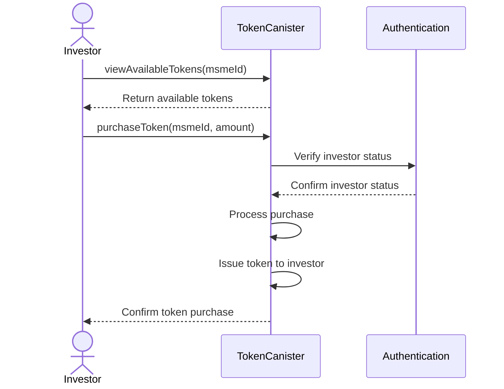
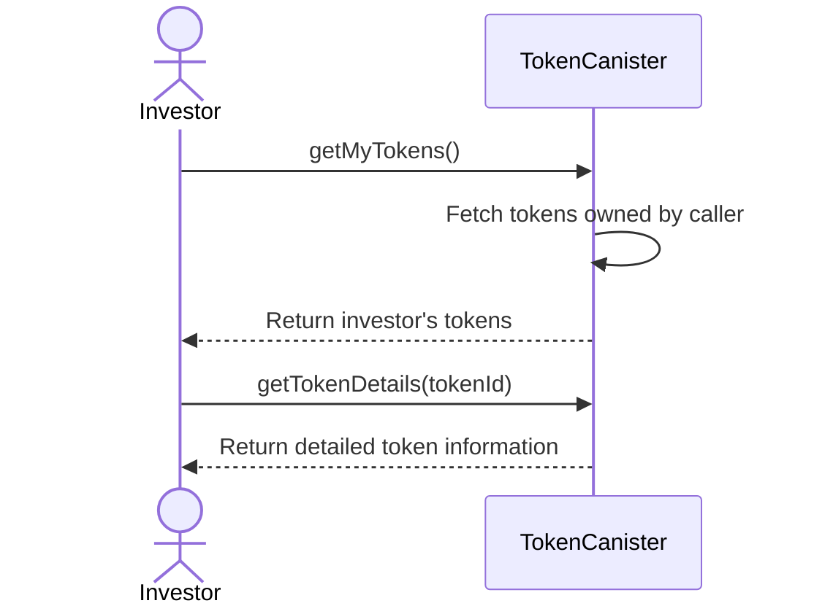
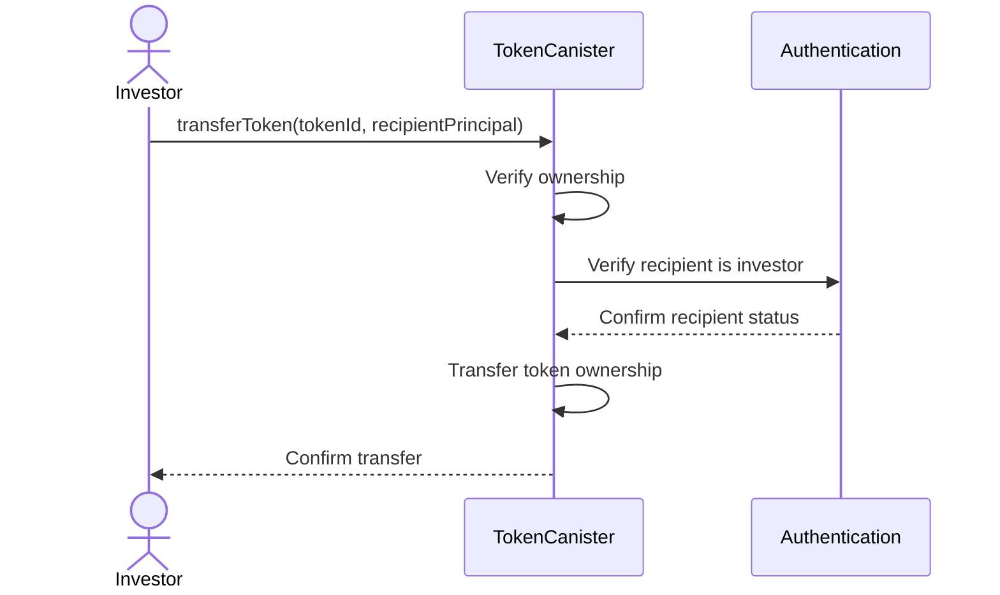
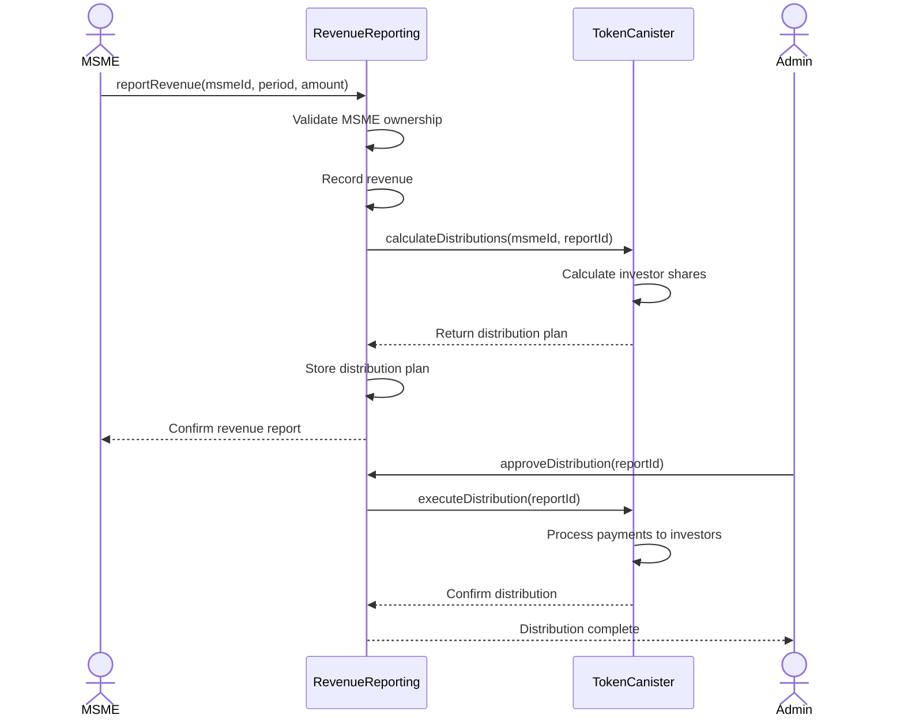
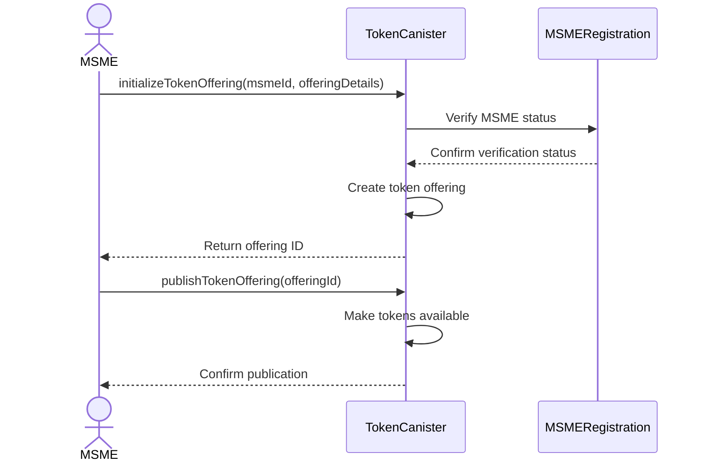
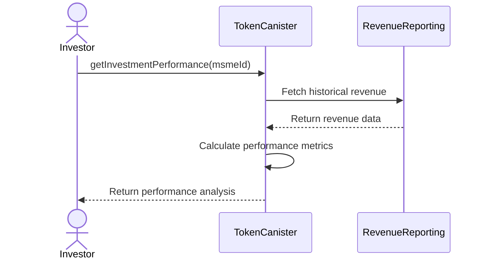

# Token and Investment Flows

This document describes the token-based investment system for MSMEs and the associated flows for investors.

## Overview

The platform uses tokens to represent ownership shares in MSMEs. Investors can purchase these tokens to support MSMEs while potentially earning returns based on the MSME's revenue and growth.

## Token Structure

Based on the codebase, tokens have the following properties:
- `tokenId`: Unique identifier for the token
- `owner`: Principal ID of the token owner
- `msmeId`: ID of the MSME the token represents
- `sharePercentage`: Percentage of ownership the token represents
- `issuedAt`: Timestamp when the token was issued

## Investment Workflows

### 1. Token Purchase Flow



### 2. Token Management Flow



### 3. Token Transfer Flow



## Revenue Distribution Flow



## MSME Token Creation Flow



## Investment Analytics Flow



## Sample Token Purchase Code
```motoko
// Conceptual implementation of token purchase
public shared(msg) func purchaseToken(msmeId: Text, amount: Nat) : async Result.Result<TokenInfo, Error> {
    let investor = msg.caller;
    
    // Verify caller is an investor
    let isInvestor = await User.isInvestor(investor);
    if (not isInvestor) {
        return #err(#NotAuthorized);
    };
    
    // Check if MSME exists and is verified
    let msmeStatus = await MSME.getVerificationStatus(msmeId);
    if (msmeStatus != #Verified) {
        return #err(#MSMENotVerified);
    };
    
    // Check if tokens are available for purchase
    let availableTokens = await getAvailableTokens(msmeId);
    if (availableTokens < amount) {
        return #err(#InsufficientTokens);
    };
    
    // Process token purchase (would include payment logic)
    let tokenId = nextTokenId;
    nextTokenId += 1;
    
    let newToken : TokenInfo = {
        tokenId = tokenId;
        owner = investor;
        msmeId = msmeId;
        sharePercentage = calculateSharePercentage(amount);
        issuedAt = Time.now();
    };
    
    // Store token information
    tokens.put(tokenId, newToken);
    
    // Update MSME token records
    updateMSMETokenSales(msmeId, amount);
    
    return #ok(newToken);
}
```

## Revenue Distribution Process

The revenue distribution process follows these steps:

1. **Revenue Reporting**: MSMEs report their revenue for a specific period
2. **Distribution Calculation**: The system calculates how much should be distributed to each investor based on their token holdings
3. **Approval Process**: An admin or the MSME approves the distribution plan
4. **Payment Execution**: The system executes payments to all investors based on their share percentages
5. **Record Keeping**: All distributions are recorded for transparency and tax purposes

This system ensures fair and transparent revenue sharing between MSMEs and their investors, creating a sustainable investment ecosystem. 