# User Role Flows

This document outlines the different user roles and their possible flows in the application.

## User Roles

Based on the codebase, the system has four primary roles:

1. **Admin** - System administrators with the highest privileges
2. **MSME** - Micro, Small, and Medium Enterprises that can register profiles
3. **Investor** - Users who can invest in MSMEs
4. **Verifier** - Users responsible for verification of MSME profiles and documents

## Authentication Flows

### 1. Registration Flow

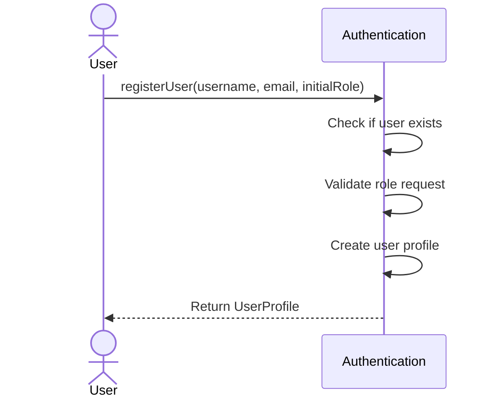
```mermaid
sequenceDiagram
    Actor User
    User->>Authentication: registerUser(username, email, initialRole)
    Authentication->>Authentication: Check if user exists
    Authentication->>Authentication: Validate role request
    Authentication->>Authentication: Create user profile
    Authentication-->>User: Return UserProfile
```

**Functions Involved:**
- `registerUser(username, email, initialRole)` - Creates a new user profile with the specified role

### 2. Login Flow

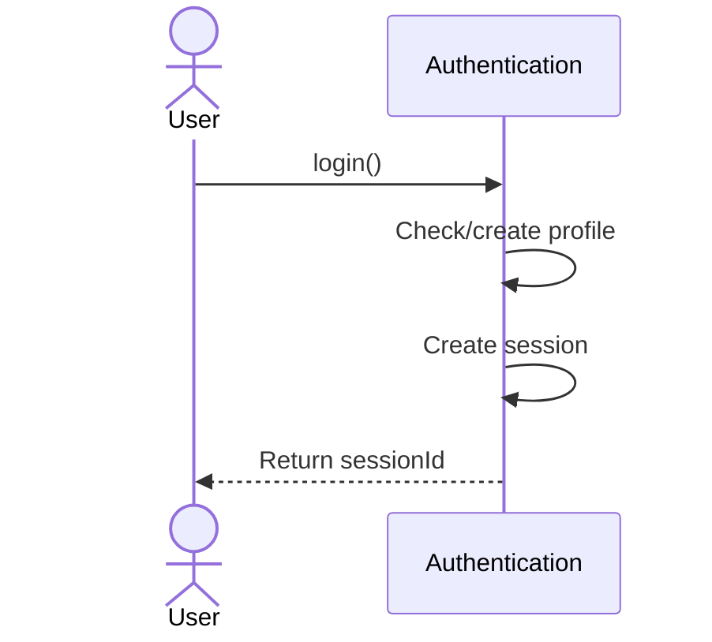
```mermaid
sequenceDiagram
    Actor User
    User->>Authentication: login()
    Authentication->>Authentication: Check/create profile
    Authentication->>Authentication: Create session
    Authentication-->>User: Return sessionId
```

**Functions Involved:**
- `login()` - Authenticates a user and creates a session
- If the user doesn't exist, a new profile is automatically created with the Investor role

### 3. Logout Flow

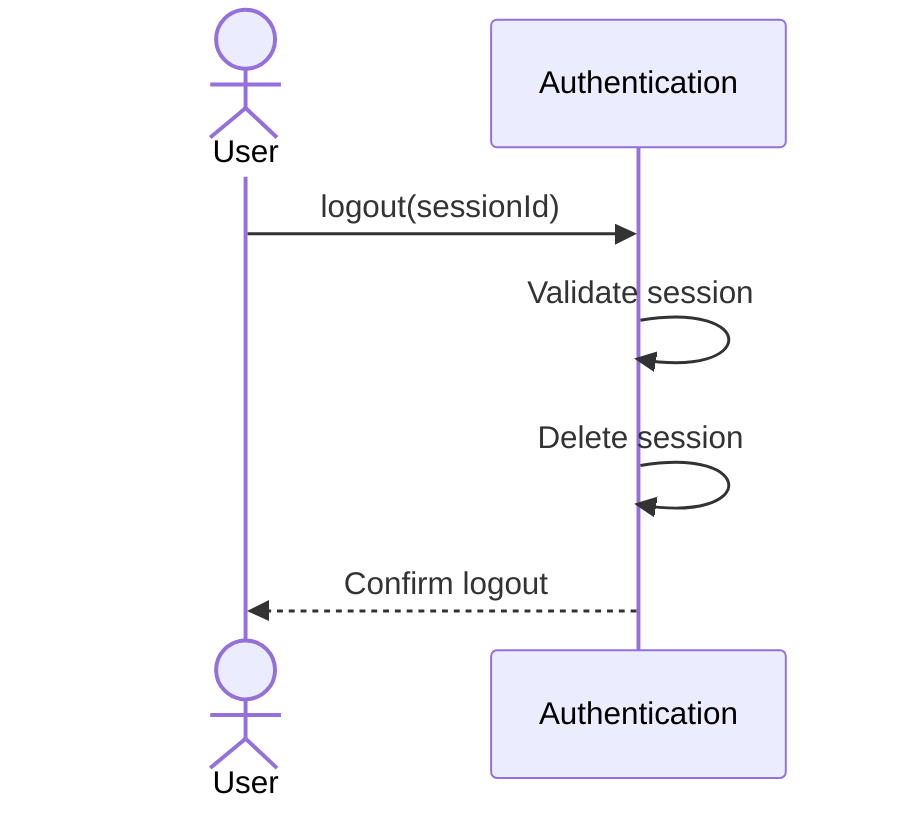
```mermaid
sequenceDiagram
    Actor User
    User->>Authentication: logout(sessionId)
    Authentication->>Authentication: Validate session
    Authentication->>Authentication: Delete session
    Authentication-->>User: Confirm logout
```

**Functions Involved:**
- `logout(sessionId)` - Ends a user session
- `validateSession(sessionId)` - Checks if a session is valid and not expired

## Admin Role Flows

### 1. User Management Flow

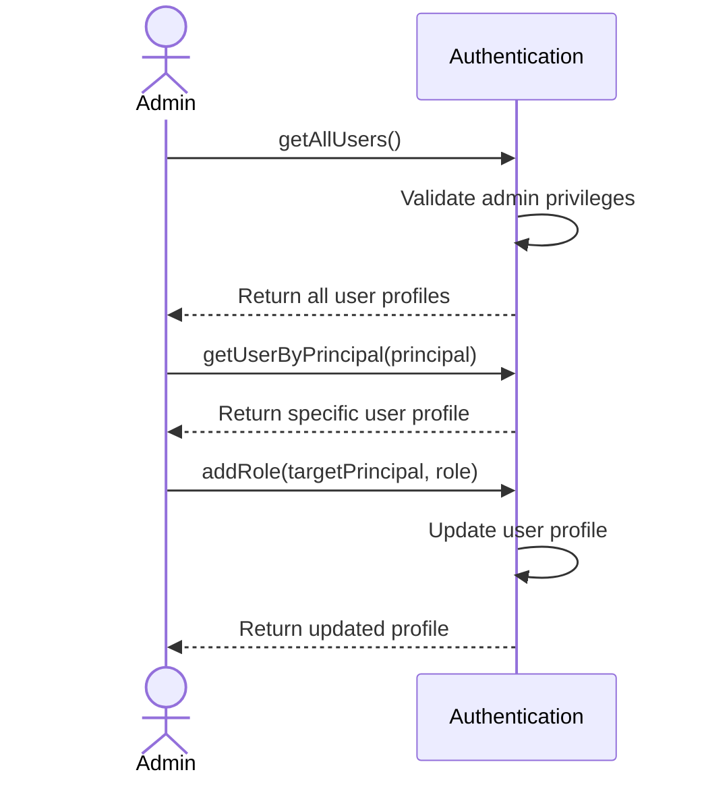
```mermaid
sequenceDiagram
    Actor Admin
    Admin->>Authentication: getAllUsers()
    Authentication->>Authentication: Validate admin privileges
    Authentication-->>Admin: Return all user profiles
    Admin->>Authentication: getUserByPrincipal(principal)
    Authentication-->>Admin: Return specific user profile
    Admin->>Authentication: addRole(targetPrincipal, role)
    Authentication->>Authentication: Update user profile
    Authentication-->>Admin: Return updated profile
```

**Functions Involved:**
- `getAllUsers()` - Retrieves all registered users
- `getUserByPrincipal(principal)` - Retrieves a specific user's profile
- `addRole(targetPrincipal, role)` - Adds a role to a user
- `removeRole(targetPrincipal, role)` - Removes a role from a user

### 2. System Administration Flow

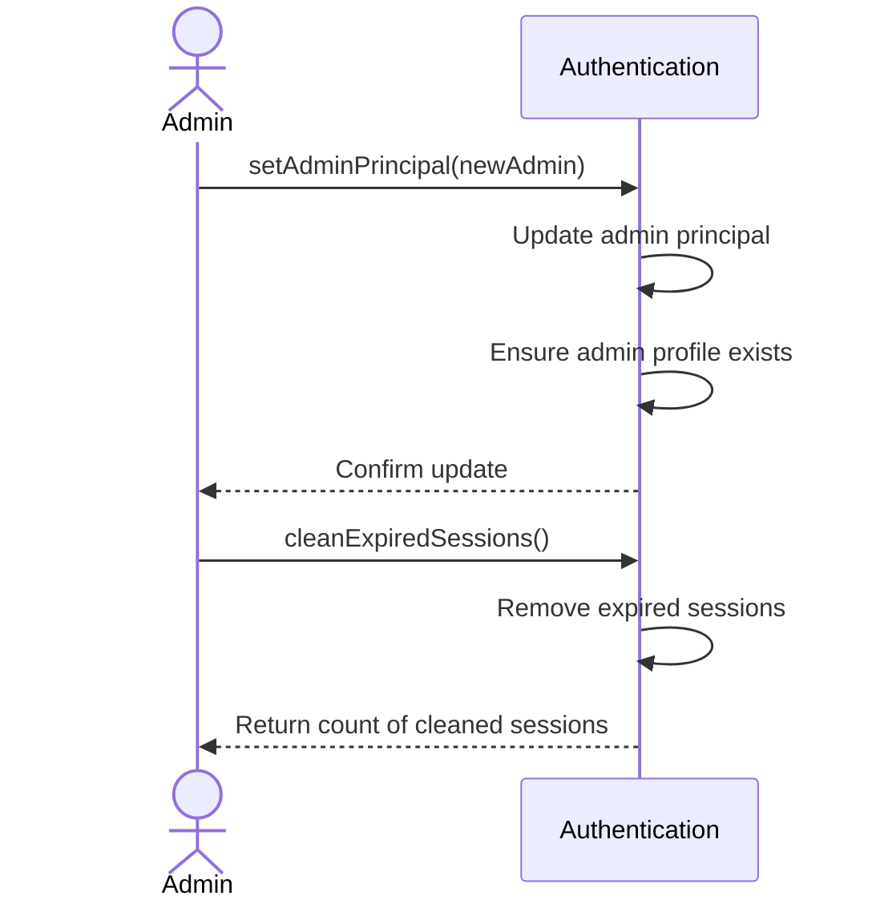
```mermaid
sequenceDiagram
    Actor Admin
    Admin->>Authentication: setAdminPrincipal(newAdmin)
    Authentication->>Authentication: Update admin principal
    Authentication->>Authentication: Ensure admin profile exists
    Authentication-->>Admin: Confirm update
    Admin->>Authentication: cleanExpiredSessions()
    Authentication->>Authentication: Remove expired sessions
    Authentication-->>Admin: Return count of cleaned sessions
```

**Functions Involved:**
- `setAdminPrincipal(newAdmin)` - Updates the principal admin user
- `cleanExpiredSessions()` - Removes expired user sessions

## MSME Role Flows

### 1. MSME Registration Flow

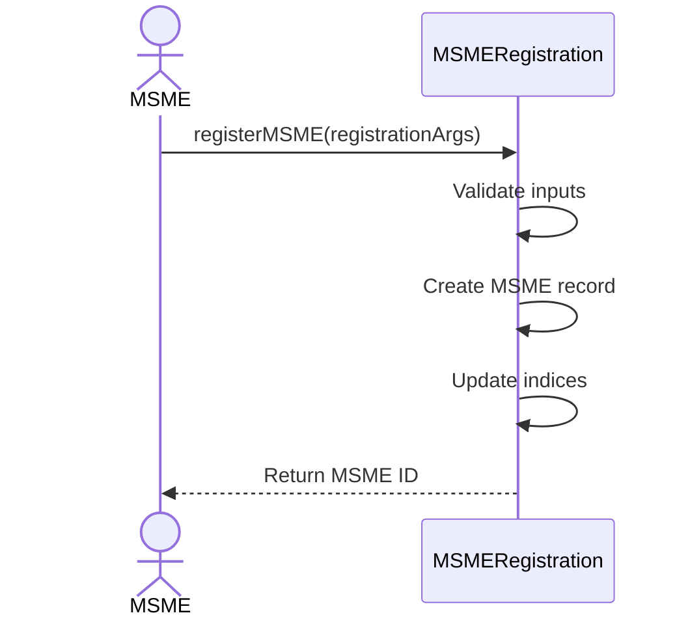
```mermaid
sequenceDiagram
    Actor MSME
    MSME->>MSMERegistration: registerMSME(registrationArgs)
    MSMERegistration->>MSMERegistration: Validate inputs
    MSMERegistration->>MSMERegistration: Create MSME record
    MSMERegistration->>MSMERegistration: Update indices
    MSMERegistration-->>MSME: Return MSME ID
```

**Functions Involved:**
- `registerMSME(args)` - Registers a new MSME with basic information

### 2. MSME Profile Management Flow

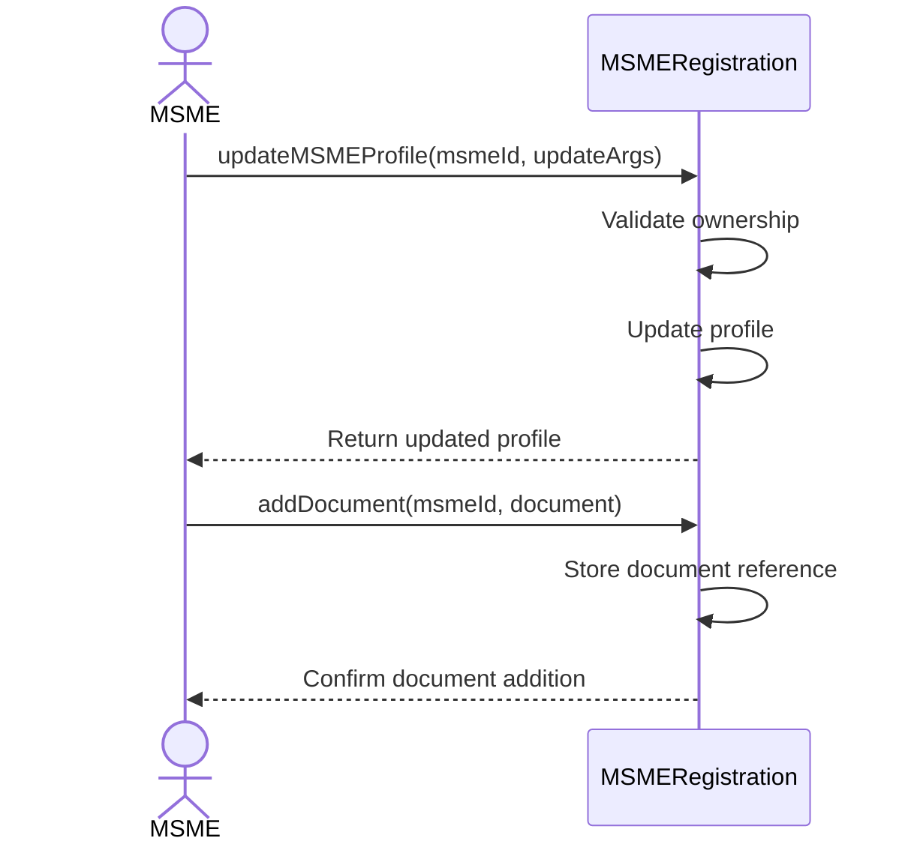
```mermaid
sequenceDiagram
    Actor MSME
    MSME->>MSMERegistration: updateMSMEProfile(msmeId, updateArgs)
    MSMERegistration->>MSMERegistration: Validate ownership
    MSMERegistration->>MSMERegistration: Update profile
    MSMERegistration-->>MSME: Return updated profile
    MSME->>MSMERegistration: addDocument(msmeId, document)
    MSMERegistration->>MSMERegistration: Store document reference
    MSMERegistration-->>MSME: Confirm document addition
```

**Functions Involved:**
- `updateMSMEProfile` - Updates MSME information
- `addDocument` - Adds documents to MSME profile

## Investor Role Flows

### 1. MSME Discovery Flow

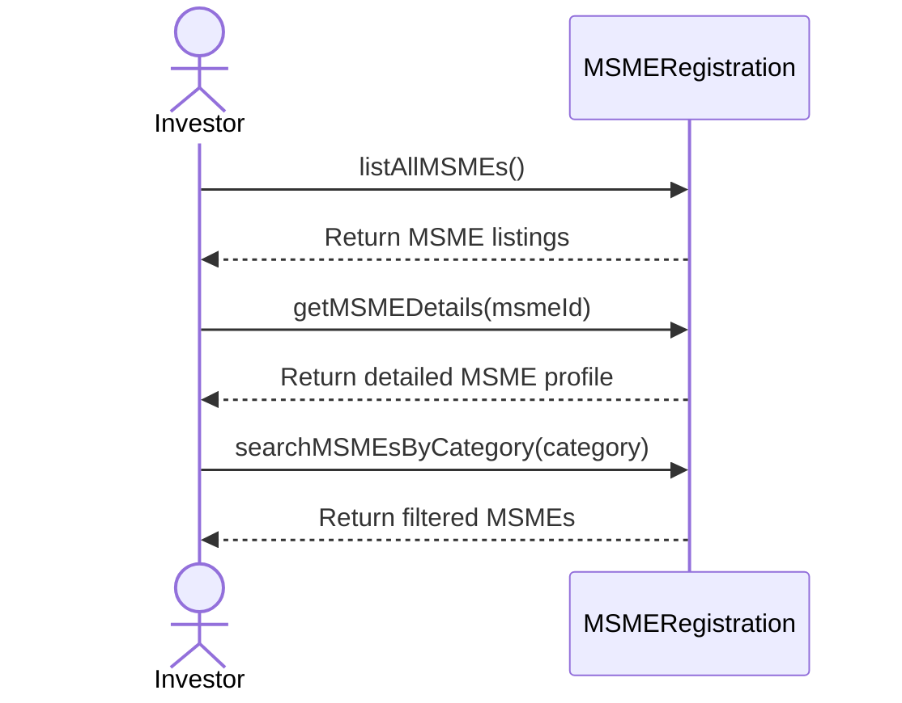
```mermaid
sequenceDiagram
    Actor Investor
    Investor->>MSMERegistration: listAllMSMEs()
    MSMERegistration-->>Investor: Return MSME listings
    Investor->>MSMERegistration: getMSMEDetails(msmeId)
    MSMERegistration-->>Investor: Return detailed MSME profile
    Investor->>MSMERegistration: searchMSMEsByCategory(category)
    MSMERegistration-->>Investor: Return filtered MSMEs
```

**Functions Involved:**
- `listAllMSMEs()` - Lists all registered MSMEs
- `getMSMEDetails(msmeId)` - Gets detailed information about a specific MSME
- `searchMSMEsByCategory(category)` - Finds MSMEs in a specific category

### 2. Investment Flow

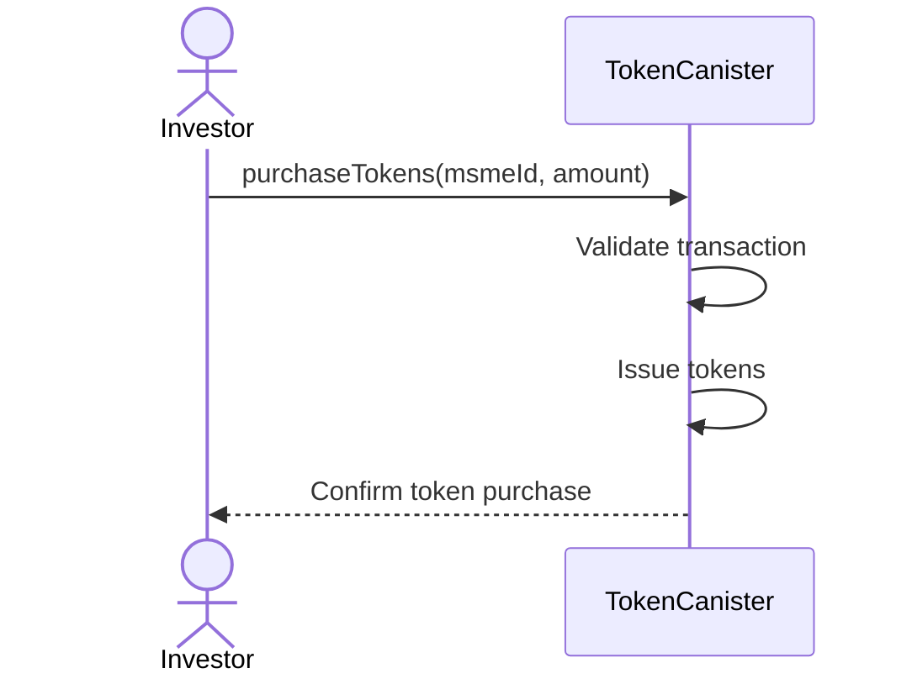
```mermaid
sequenceDiagram
    Actor Investor
    Investor->>TokenCanister: purchaseTokens(msmeId, amount)
    TokenCanister->>TokenCanister: Validate transaction
    TokenCanister->>TokenCanister: Issue tokens
    TokenCanister-->>Investor: Confirm token purchase
```

**Functions Involved:**
- Token purchase functions from the token canister

## Verifier Role Flows

### 1. Verification Flow

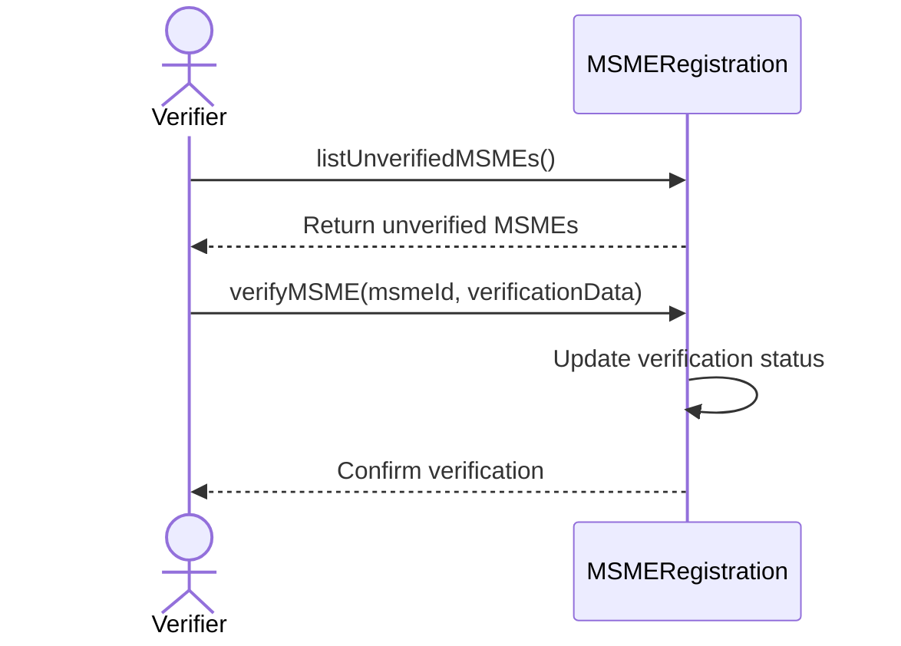
```mermaid
sequenceDiagram
    Actor Verifier
    Verifier->>MSMERegistration: listUnverifiedMSMEs()
    MSMERegistration-->>Verifier: Return unverified MSMEs
    Verifier->>MSMERegistration: verifyMSME(msmeId, verificationData)
    MSMERegistration->>MSMERegistration: Update verification status
    MSMERegistration-->>Verifier: Confirm verification
```

**Functions Involved:**
- `listUnverifiedMSMEs()` - Lists MSMEs awaiting verification
- `verifyMSME(msmeId, verificationData)` - Updates verification status of an MSME

### 2. Document Verification Flow

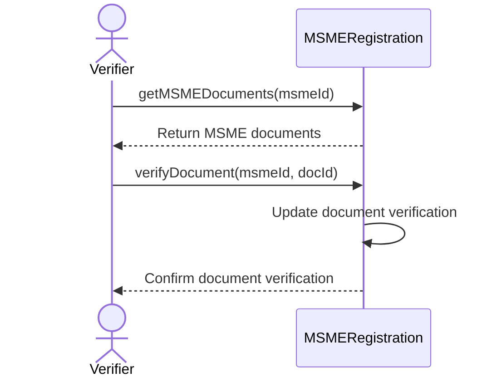
```mermaid
sequenceDiagram
    Actor Verifier
    Verifier->>MSMERegistration: getMSMEDocuments(msmeId)
    MSMERegistration-->>Verifier: Return MSME documents
    Verifier->>MSMERegistration: verifyDocument(msmeId, docId)
    MSMERegistration->>MSMERegistration: Update document verification
    MSMERegistration-->>Verifier: Confirm document verification
```

**Functions Involved:**
- `getMSMEDocuments(msmeId)` - Gets documents for a specific MSME
- `verifyDocument(msmeId, docId)` - Marks a document as verified

## Common Flows

### 1. Profile Management Flow

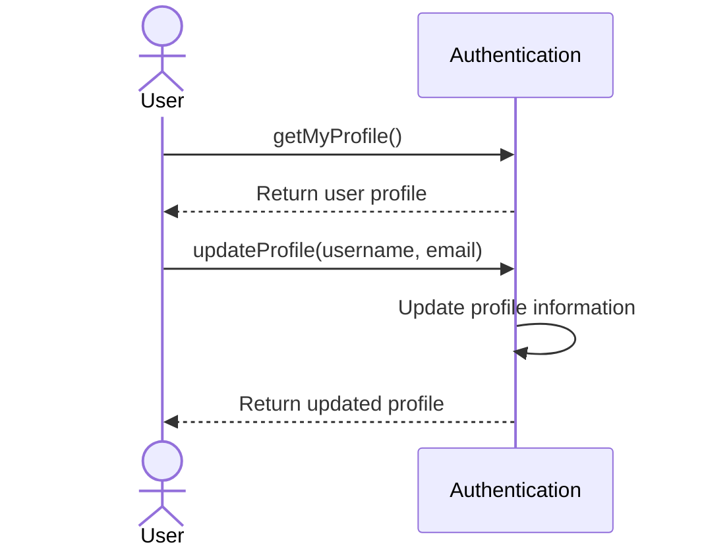
```mermaid
sequenceDiagram
    Actor User
    User->>Authentication: getMyProfile()
    Authentication-->>User: Return user profile
    User->>Authentication: updateProfile(username, email)
    Authentication->>Authentication: Update profile information
    Authentication-->>User: Return updated profile
```

**Functions Involved:**
- `getMyProfile()` - Gets the current user's profile
- `updateProfile(username, email)` - Updates profile information

### 2. Session Management Flow

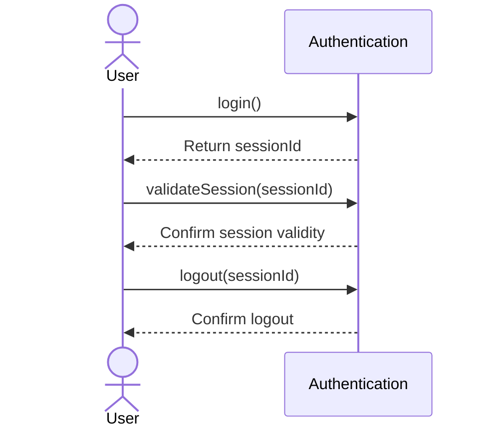
```mermaid
sequenceDiagram
    Actor User
    User->>Authentication: login()
    Authentication-->>User: Return sessionId
    User->>Authentication: validateSession(sessionId)
    Authentication-->>User: Confirm session validity
    User->>Authentication: logout(sessionId)
    Authentication-->>User: Confirm logout
```

**Functions Involved:**
- `login()` - Creates a new session
- `validateSession(sessionId)` - Validates an existing session
- `logout(sessionId)` - Ends a session 