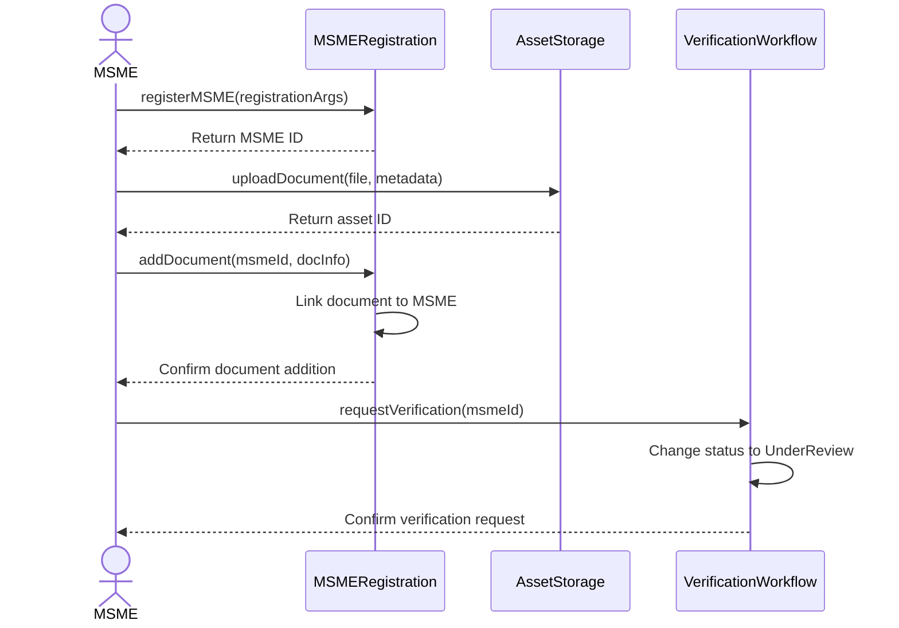
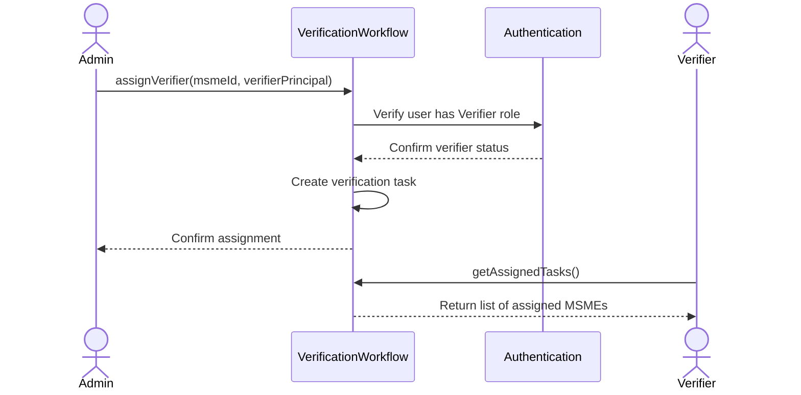
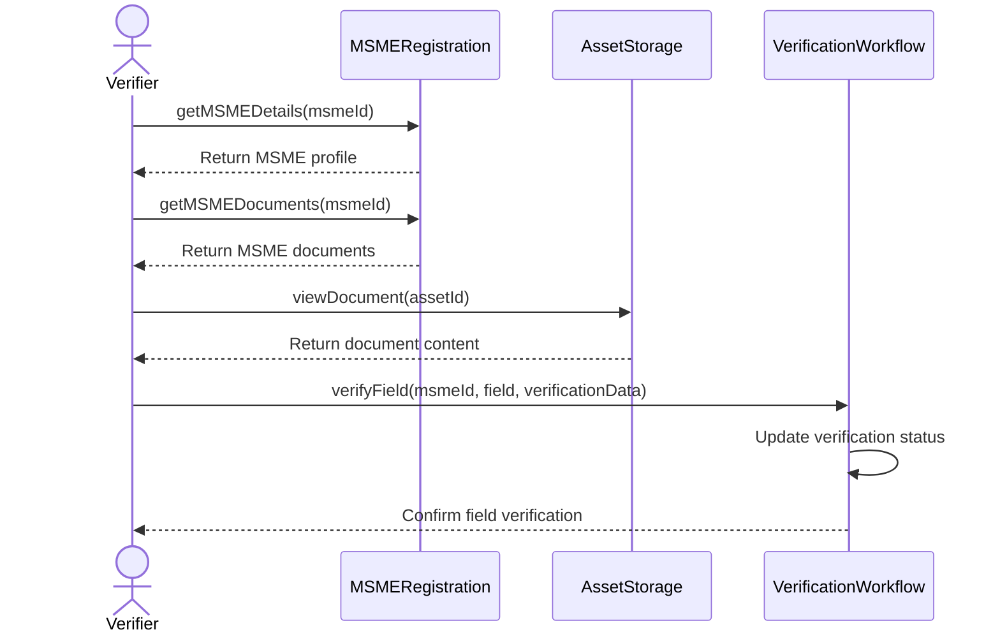
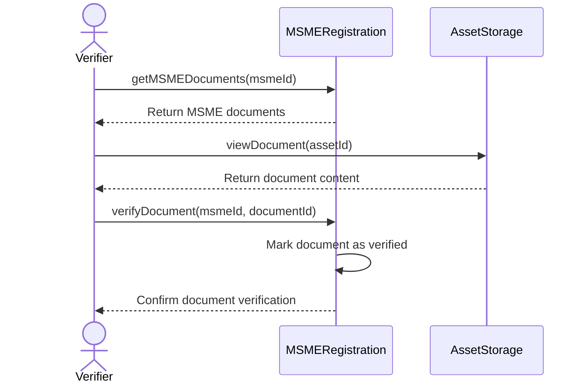
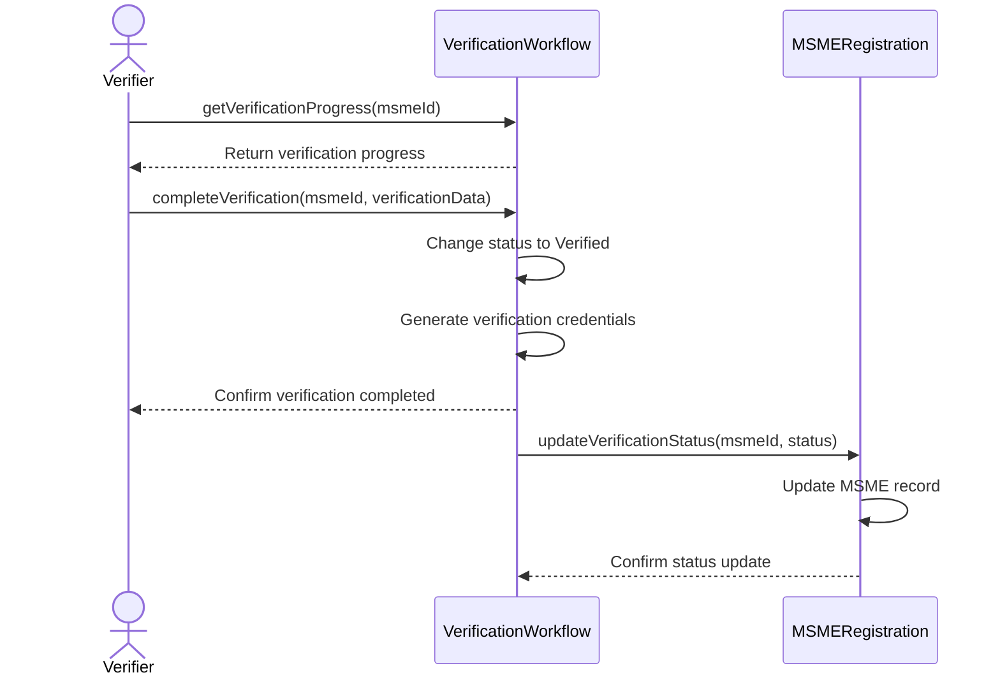
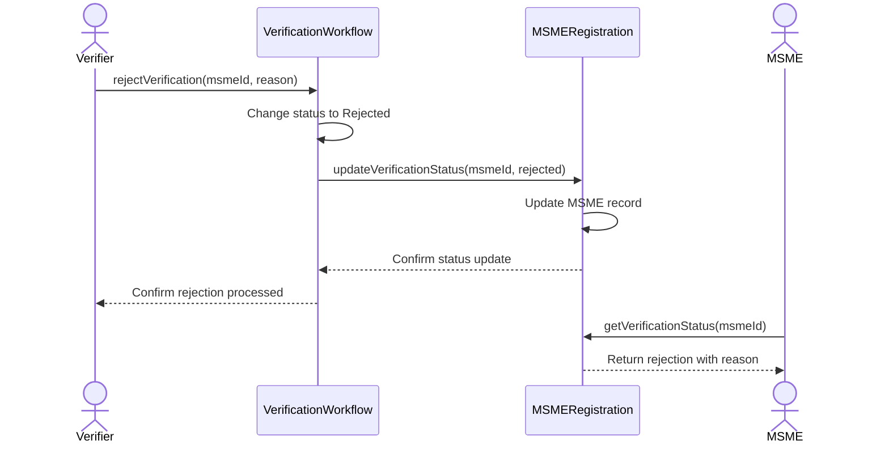
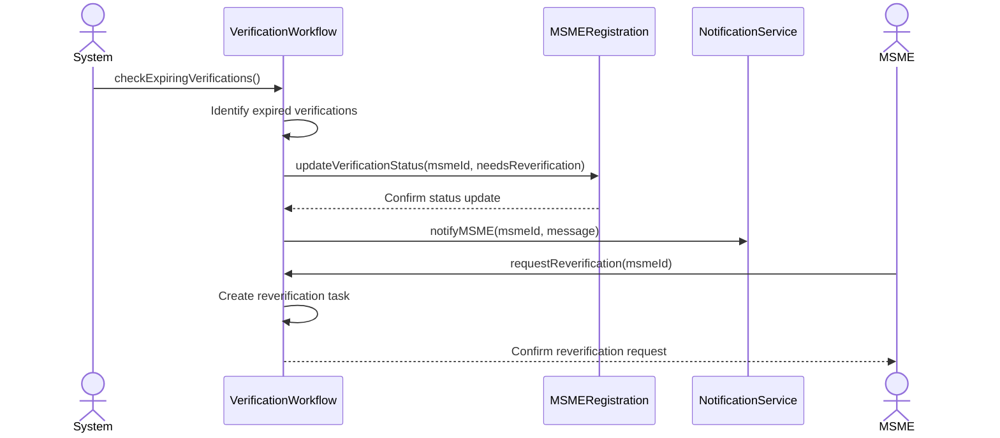
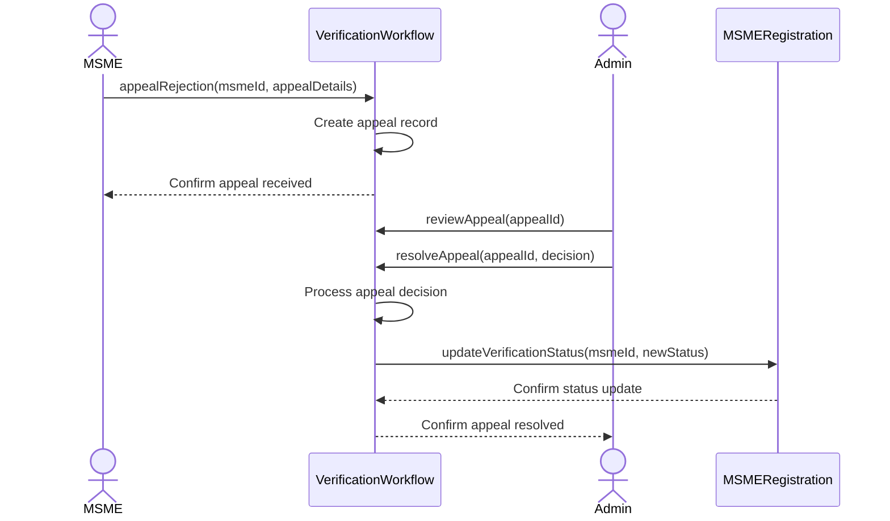

# MSME Verification Workflows

This document outlines the verification processes for MSMEs in the system, detailing how businesses move from unverified to verified status.

## Verification Status Types

Based on the codebase, MSMEs can have the following verification statuses:

1. **Unverified** - Initial status for newly registered MSMEs
2. **UnderReview** - MSME profile is being reviewed by verifiers
3. **PartiallyVerified** - Some aspects of the MSME have been verified
4. **Verified** - MSME is fully verified with verification credentials
5. **Rejected** - MSME verification was rejected with a reason

## Verification Fields

The system supports verification of specific fields:
- **Identity** - Verification of the owner's identity
- **BusinessRegistration** - Verification of business registration documents
- **FinancialRecords** - Verification of financial statements and records
- **ImpactCredentials** - Verification of social impact claims
- **Other** - Additional custom verification fields

## Verification Process Flows

### 1. MSME Document Submission Flow



**Functions Involved:**
- `uploadDocument` - Uploads document to asset storage
- `addDocument` - Links document to MSME profile
- `requestVerification` - Requests verification for an MSME

### 2. Verifier Assignment Flow



**Functions Involved:**
- `assignVerifier` - Assigns a verifier to review an MSME
- `getAssignedTasks` - Gets list of MSMEs assigned to a verifier

### 3. Verification Review Flow



**Functions Involved:**
- `getMSMEDetails` - Gets detailed profile of an MSME
- `getMSMEDocuments` - Gets list of documents for an MSME
- `viewDocument` - Views content of a specific document
- `verifyField` - Marks a specific field as verified

### 4. Document Verification Flow



**Functions Involved:**
- `getMSMEDocuments` - Gets list of documents for an MSME
- `viewDocument` - Views content of a specific document
- `verifyDocument` - Marks a document as verified

### 5. Final Verification Approval Flow



**Functions Involved:**
- `getVerificationProgress` - Gets current verification progress
- `completeVerification` - Completes the verification process
- `updateVerificationStatus` - Updates the MSME's verification status

### 6. Rejection Flow



**Functions Involved:**
- `rejectVerification` - Rejects an MSME verification
- `updateVerificationStatus` - Updates the MSME's verification status
- `getVerificationStatus` - Gets current verification status

## Verification Levels

The system supports multiple verification levels:

1. **Level 1** - Basic verification (identity and business registration)
2. **Level 2** - Standard verification (includes financial records)
3. **Level 3** - Premium verification (comprehensive verification with impact credentials)

## Verification Data Structure

```motoko
public type VerificationData = {
    verifiedBy : Principal;
    verificationDate : Time.Time;
    expiryDate : ?Time.Time;
    verificationLevel : Nat; // 1-3, with 3 being highest
    credentials : ?Text; // Reference to verification credential
};
```

## Re-verification Process

Verifications may have an expiry date, after which the MSME needs to undergo re-verification:



**Functions Involved:**
- `checkExpiringVerifications` - System check for expiring verifications
- `requestReverification` - MSME requests reverification

## Verification Appeal Process

If an MSME is rejected, they can appeal the decision:



**Functions Involved:**
- `appealRejection` - MSME appeals a verification rejection
- `reviewAppeal` - Admin reviews an appeal
- `resolveAppeal` - Admin resolves an appeal with a decision 